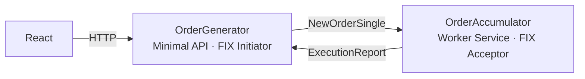
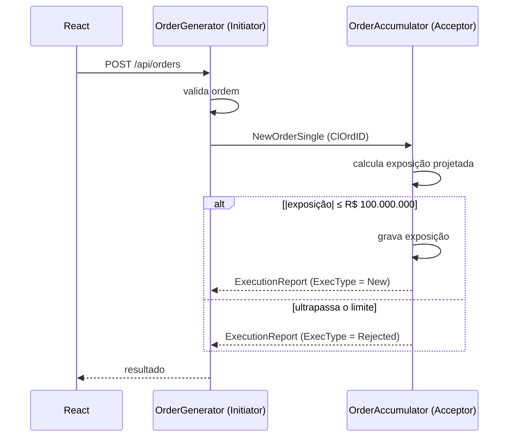

# OrderSystem

Duas aplicações independentes que se comunicam via FIX 4.4 (QuickFIX/n):

- **OrderGenerator**: API em C# com frontend React. Envia ordens (`NewOrderSingle`).
- **OrderAccumulator**: serviço em C#. Calcula a exposição financeira por símbolo e aceita ou rejeita cada ordem (`ExecutionReport`).

As aplicações não têm dependência de código entre si. A única integração é a sessão FIX.

## Arquitetura





### Decisões

**Geral**

- .NET 10 e QuickFIXn 1.14.1 (`QuickFIXn.Core`, `QuickFIXn.FIX44`).
- Regras de negócio em projetos `.Core`, sem dependência do QuickFIX nem do ASP.NET.
- Valores monetários em `decimal`.
- Estado em memória.
- Sessão FIX com `ResetOnLogon=Y` (estado em memória) e `UseDataDictionary=N` (validação dos campos feita na origem).

**OrderAccumulator**

- Cálculo, verificação do limite e gravação executados de forma atômica (`lock`).
- Rejeição por limite com `OrdRejReason = 3` (Order exceeds limit).
- Valida apenas o necessário para o cálculo (lado Compra ou Venda, quantidade e preço positivos). Ordens inválidas são respondidas com `ExecType = Rejected` e `OrdRejReason = 99` (Other), sem afetar a exposição. As regras do formulário são responsabilidade do OrderGenerator.
- Erros inesperados no processamento de mensagens são registrados em log e repassados ao QuickFIX/n para o tratamento padrão do protocolo.
- Acceptor iniciado e encerrado por um `IHostedService`; `ExposureCalculator` registrado como singleton.

**OrderGenerator**

- ASP.NET Core Minimal API, com o endpoint em arquivo próprio e respostas tipadas (`TypedResults`).
- Validação das regras do formulário em `OrderGenerator.Core`, retornando todos os erros por campo.
- A requisição HTTP aguarda o `ExecutionReport` correspondente, correlacionado pelo `ClOrdID` (`TaskCompletionSource` em um `ConcurrentDictionary`), com timeout de 5 segundos.
- A ordem é registrada antes do envio, evitando perder respostas que cheguem antes do registro.
- Enums trafegam como texto no JSON (`"side": "Buy"`, `"status": "Rejected"`).
- CORS liberado para o frontend em `http://localhost:5173`.

| Situação | HTTP | Verbo |
|---|---| --- |
| Ordem aceita ou rejeitada pelo OrderAccumulator | `200` | **OK** |
| Campos inválidos | `400` (erros por campo) | **Bad Request** |
| Sessão FIX desconectada | `503` | **Service Unavailable** |
| Sem resposta em 5 segundos | `504` | **Gateway Timeout** |

Uma ordem rejeitada pelo limite retorna `200`: a requisição foi processada e o resultado é `Rejected`.

**Frontend**

- React + TypeScript com Vite, sem bibliotecas de componentes ou de formulário.
- Validação no navegador apenas para usabilidade; a API é a autoridade e seus erros de validação são exibidos nos campos correspondentes.
- O preço é digitado a partir dos centavos, no padrão brasileiro: cada dígito entra pela direita (`1` → `0,01`, `10` → `0,10`, `1050` → `10,50`), até o limite de `999,99`. O valor é mantido em centavos inteiros, o que garante o múltiplo de 0,01 sem aritmética de ponto flutuante, e é convertido para o formato da API apenas no envio.
- A quantidade aceita somente dígitos, é exibida com separador de milhar e limitada a `99.999` no próprio campo.
- A partir do primeiro campo preenchido, um resumo ao lado do formulário mostra a ordem em tempo real, incluindo o volume financeiro (quantidade × preço) e o limite de exposição por símbolo.
- Símbolo e Lado são apresentados como controles segmentados. O layout é claro e minimalista, com tons usados apenas como destaque baseado na no site da base.
- O Lado é exibido como Compra/Venda e enviado como `Buy`/`Sell`.
- Quando a API responde à ordem (aceita ou rejeitada), o formulário é limpo, o resumo é ocultado e o resultado é exibido em uma modal (`<dialog>` nativo), fechada pelo botão OK ou pela tecla Esc. Em caso de falha de conexão, sessão FIX indisponível ou timeout, os campos são mantidos para nova tentativa e o erro aparece ao lado do formulário.
- A chamada HTTP é isolada em `api/OrdersApi.ts`, que converte cada resposta (`200`, `400`, `503`, `504` ou falha de rede) em um resultado tipado.
- URL da API configurada por variável de ambiente (`VITE_API_URL`).
- O frontend não possui testes automatizados; as regras de negócio e de validação são cobertas pelos testes do backend.

### Premissas

- Quantidade executada = quantidade da ordem aceita.
- Exposição igual a R$ 100.000.000 é aceita; somente valores acima são rejeitados.
- O limite se aplica em valor absoluto (compra e venda).

## Trade-offs

Cada decisão resolve um problema e aceita um custo. As tabelas abaixo registram os dois lados.

### Arquitetura e plataforma

| Decisão | Ganho | Custo |
|---|---|---|
| Duas aplicações na mesma solution, em pastas separadas e sem referências cruzadas | Independência explícita, com build e testes em um único comando | Um leitor desatento pode interpretar como uma aplicação só; a independência depende da disciplina de não referenciar projetos entre as pastas |
| Frontend fora da solution, em `frontend/` | Cada ecossistema com seu ferramental, sem depender do Visual Studio para o React | Mais um comando para subir o sistema; a relação com o OrderGenerator fica documentada, não expressa na estrutura da solution |
| .NET 10 e QuickFIXn 1.14.1 | Versão LTS e a única combinação suportada tanto pela Microsoft quanto pelo QuickFIX/n a médio prazo | Exige SDK recente na máquina de quem executa |
| Regras de negócio em projetos `.Core` | Regras testáveis sem rede, sem QuickFIX e sem ASP.NET | Mais projetos e referências para um escopo pequeno |
| `Order` e `OrderSide` definidos em cada aplicação | Nenhum acoplamento de código; o contrato entre as aplicações é apenas o FIX | Duplicação: uma mudança no contrato exige ajustes nos dois lados |
| `decimal` para preço, quantidade e exposição | Aritmética exata, sem erros de arredondamento | Custo de processamento maior que `double` |
| Estado em memória | Simplicidade, sem banco de dados | A exposição é zerada ao reiniciar o OrderAccumulator, e o serviço não pode ter mais de uma instância |
| `ResetOnLogon=Y` | Nenhum conflito de numeração de sequência após reinícios | Perde a garantia de reenvio de mensagens entre sessões; aceitável porque o estado também não sobrevive ao reinício |
| `UseDataDictionary=N` | Não é necessário distribuir o `FIX44.xml` | O motor não valida tipos e valores dos campos contra a especificação; a validação fica a cargo das aplicações |

### OrderAccumulator

| Decisão | Ganho | Custo |
|---|---|---|
| Um único `lock` para calcular, verificar e gravar | Atomicidade simples e comprovada por teste de concorrência | Serializa ordens de todos os símbolos; um `lock` por símbolo teria mais vazão, com mais complexidade |
| Rejeitar apenas exposições **acima** de R$ 100.000.000 | Leitura literal de "ultrapassar" | Se a intenção fosse `≥`, a regra e um teste precisam mudar |
| Quantidade executada = quantidade da ordem aceita | Atende ao enunciado sem simular execuções | Não modela execuções parciais (`PartiallyFilled`/`Filled`) |
| `OrdRejReason` 3 (limite) e 99 (ordem inválida) | Códigos padrão do protocolo, interpretáveis por qualquer cliente FIX | O código 99 é genérico; o motivo detalhado fica apenas no campo `Text` |
| Validação mínima no Accumulator, sem exceções (`TryToOrder`) | O servidor não confia cegamente no cliente e não duplica as regras do formulário | Símbolos e limites do formulário não são revalidados; outro cliente FIX poderia enviar símbolos fora da lista |
| `try/catch` no `FromApp` com log e `throw` | Rastreabilidade sem esconder erros do QuickFIX/n | Erros inesperados não viram `ExecutionReport`; o cliente depende do tratamento padrão do protocolo ou do próprio timeout |
| `IHostedService` para o Acceptor | Contrato mínimo; o QuickFIX/n já gerencia as próprias threads | Não há health check da sessão exposto pela aplicação |

### OrderGenerator

| Decisão | Ganho | Custo |
|---|---|---|
| Minimal API | Pouca cerimônia para um único endpoint | A organização depende de disciplina (endpoint em arquivo próprio), sem a estrutura imposta pelos controllers |
| Requisição HTTP aguarda o `ExecutionReport` (`TaskCompletionSource` + `ConcurrentDictionary`) | O usuário recebe o resultado real na mesma requisição | Cada ordem mantém uma conexão aberta por até 5 segundos, e as pendências ficam em memória; um modelo assíncrono (`202 Accepted` com consulta posterior ou WebSocket) escalaria melhor |
| Timeout fixo de 5 segundos | Evita requisições presas indefinidamente | Não é configurável; se o OrderAccumulator responder depois do prazo, o usuário recebe `504`, mas a ordem pode ter sido aceita e alterado a exposição |
| Registrar a ordem antes de enviá-la | Elimina a condição de corrida com respostas muito rápidas | Nenhum relevante |
| Rejeição por limite retorna `200` | Semântica HTTP correta: a requisição foi processada | O cliente precisa ler o `status` no corpo para saber o resultado |
| `ClOrdID` como GUID | Unicidade sem coordenação entre instâncias | Identificador longo e pouco legível em logs |
| Enums como texto no JSON | Contrato legível (`"side": "Buy"`) | Os nomes dos enums passam a fazer parte do contrato público da API |
| CORS fixo para `http://localhost:5173` | Restritivo por padrão | Uma nova origem exige alteração de código; o ideal seria configuração |
| Host FIX sobrescrito por `Fix__ConnectHost` | O mesmo `.cfg` serve para execução local e no Docker | A configuração da sessão fica dividida entre o arquivo `.cfg` e variáveis de ambiente |

### Frontend

| Decisão | Ganho | Custo |
|---|---|---|
| Sem bibliotecas de formulário ou de componentes | Menos dependências e código fácil de ler | Estado e validação escritos à mão; em formulários maiores, bibliotecas como React Hook Form e Zod compensariam |
| Validação no navegador e na API | Retorno imediato ao usuário, com a API como autoridade | As regras existem em dois lugares e podem divergir |
| Preço digitado a partir dos centavos | Valor exato, no padrão brasileiro, sem tratar vírgula ou ponto | Colar `10,5` resulta em `1,05`; o cursor fica sempre no final do campo |
| Limites aplicados no próprio campo (`999,99` e `99.999`) | Impossível digitar um valor fora das regras | A digitação excedente é ignorada sem mensagem ao usuário |
| Resumo com volume financeiro | Contexto de risco antes do envio | A exposição acumulada real do símbolo não é exibida, pois a API não a expõe |
| Resultado em modal (`<dialog>` nativo) | Acessibilidade (foco, Esc, bloqueio do fundo) sem bibliotecas | Interrompe o fluxo até o usuário fechar a modal |
| Formulário limpo também após rejeição | Comportamento uniforme após cada envio | Para ajustar uma ordem rejeitada, o usuário precisa digitá-la novamente |
| Sem testes automatizados no frontend | Tempo concentrado nas regras de negócio do backend | Regressões de interface só são detectadas manualmente |
| `VITE_API_URL` definida no build | Configuração simples por ambiente | Alterar a URL da API exige um novo build |

## Extras

| Decisão | Ganho | Custo |
|---|---|---|
| CI/CD com GitHub Actions e ambientes, sem deploy | Pipeline real e verificável, com aprovação para produção | A "publicação" gera apenas artefatos; a aprovação obrigatória exige repositório público em contas gratuitas |
| Testes executados novamente no CD | Garante que o código resultante do merge funciona | Tempo de pipeline duplicado entre CI e CD |
| Docker Compose | Todo o sistema sobe com um comando, sem .NET ou Node instalados | Primeira execução lenta; imagens sem otimizações de tamanho (trimming, AOT) |
| Perfil `OrderSystem.slnLaunch` | Um F5 inicia a API e o Worker no Visual Studio | Específico do Visual Studio; Rider e VS Code precisam de configuração própria |

## Estrutura

```
backend/
├── OrderSystem.slnx
├── OrderAccumulator/
│   ├── src/
│   │   ├── OrderAccumulator.Core/
│   │   │   ├── Orders/        Order, OrderSide
│   │   │   └── Exposure/      ExposureCalculator, ExposureDecision
│   │   └── OrderAccumulator.Worker/
│   │       ├── Fix/           AccumulatorFixApp, FixOrderTranslator
│   │       ├── Services/      FixAcceptorService
│   │       ├── SessionConfig/ fix-acceptor.cfg
│   │       └── Program.cs
│   └── tests/
│           ├── CoreExposure/  ExposureCalculatorTests
│           └── WorkerFix/     FixOrderTranslatorTests
└── OrderGenerator/
    ├── src/
    │   ├── OrderGenerator.Core/
    │   │   ├── Orders/        Order, OrderSide
    │   │   └── Validation/    OrderValidator
    │   └── OrderGenerator.Api/
    │       ├── Contracts/     OrderRequest, OrderResponse, OrderStatus
    │       ├── Endpoints/     OrderEndpoints
    │       ├── Fix/           GeneratorFixApp, FixOrderSender, FixOrderTranslator,
    │       │                  PendingOrderRegistry, IOrderSender, FixSessionUnavailableException
    │       ├── Services/      FixInitiatorService
    │       ├── SessionConfig/ fix-initiator.cfg
    │       ├── OrderGenerator.Api.http
    │       └── Program.cs
    └── tests/
        └── OrderGenerator.Tests/
            ├── CoreValidation/ OrderValidatorTests
            └── ApiFix/         FixOrderTranslatorTests, PendingOrderRegistryTests

frontend/
└── order-generator-web/
    ├── src/
    │   ├── api/           OrdersApi
    │   ├── orders/        types, validations, price, quantity
    │   ├── components/    OrderForm, OrderSummary, OrderResult, ResultModal
    │   ├── App.tsx
    │   └── main.tsx
    └── .env.development   VITE_API_URL
```

## Testes

xUnit, sem dependência de rede. 56 testes no total.

### OrderAccumulator

**ExposureCalculatorTests**

| Teste | Regra |
|---|---|
| `Simbolo_sem_ordens_tem_exposicao_zero` | Exposição inicial é zero |
| `Compra_aceita_aumenta_a_exposicao` | Compra soma preço × quantidade |
| `Venda_aceita_diminui_a_exposicao` | Venda subtrai preço × quantidade |
| `Compra_e_venda_se_compensam` | Compras e vendas se compensam |
| `Exposicao_e_calculada_por_simbolo` | Exposição independente por símbolo |
| `Ordem_que_atinge_exatamente_o_limite_e_aceita` | Limite exato é aceito |
| `Compra_que_ultrapassa_o_limite_e_rejeitada` | Acima de +100M é rejeitada |
| `Venda_que_ultrapassa_o_limite_negativo_e_rejeitada` | Abaixo de −100M é rejeitada |
| `Ordem_rejeitada_nao_altera_a_exposicao` | Rejeitada não entra no cálculo |
| `Ordem_que_reduz_a_exposicao_e_aceita_mesmo_no_limite` | Ordem que reduz a exposição é aceita |
| `Ordens_concorrentes_nunca_ultrapassam_o_limite` | 1.000 ordens paralelas de R$ 50M: exatamente 2 aceitas |

**FixOrderTranslatorTests**

| Teste | Regra |
|---|---|
| `TryToOrder_converte_os_campos_da_mensagem` | `NewOrderSingle` → `Order` (compra e venda) |
| `TryToOrder_rejeita_lado_nao_suportado` | Lado diferente de Compra/Venda é recusado com motivo |
| `TryToOrder_rejeita_quantidade_ou_preco_nao_positivo` | Quantidade ou preço ≤ 0 é recusado com motivo |
| `Ordem_aceita_gera_ExecutionReport_New` | `ExecType`/`OrdStatus = New`, mesmo `ClOrdID`, campos obrigatórios da 4.4 |
| `Ordem_rejeitada_gera_ExecutionReport_Rejected` | `ExecType`/`OrdStatus = Rejected`, `OrdRejReason = 3`, `Text`, `LeavesQty = 0` |
| `Ordem_invalida_gera_ExecutionReport_Rejected` | `ExecType`/`OrdStatus = Rejected`, `OrdRejReason = 99`, `Text`, `LeavesQty = 0` |

### OrderGenerator

**OrderValidatorTests**

| Teste | Regra |
|---|---|
| `Ordem_valida_nao_tem_erros` | Ordem dentro de todas as regras é aceita |
| `Simbolos_permitidos_sao_aceitos` | PETR4, VALE3 e VIIA4 |
| `Simbolo_fora_da_lista_e_rejeitado` | Outro símbolo, minúsculas, vazio ou nulo |
| `Lado_invalido_e_rejeitado` | Lado fora de Compra/Venda |
| `Quantidade_dentro_do_limite_e_aceita` | 1 e 99.999 |
| `Quantidade_fora_do_limite_e_rejeitada` | 0, negativa e 100.000 |
| `Preco_valido_e_aceito` | 0,01, 10,50 e 999,99 |
| `Preco_invalido_e_rejeitado` | 0, negativo, 1.000, acima de 1.000 e não múltiplo de 0,01 |
| `Varios_erros_sao_retornados_juntos` | Todos os erros retornados em uma única resposta |

**FixOrderTranslatorTests**

| Teste | Regra |
|---|---|
| `ToNewOrderSingle_preenche_os_campos_da_mensagem` | `ClOrdID`, símbolo, lado, quantidade, preço, `OrdType = Limit` e `TransactTime` |
| `ExecutionReport_New_vira_resposta_New` | Status `New`, `ClOrdID`, `OrderID` e dados da ordem |
| `ExecutionReport_Rejected_vira_resposta_Rejected_com_motivo` | Status `Rejected` com o texto do motivo |

**PendingOrderRegistryTests**

| Teste | Regra |
|---|---|
| `Ordem_registrada_fica_aguardando_resposta` | Registro devolve uma tarefa pendente |
| `Resposta_completa_a_ordem_aguardando` | A resposta é entregue a quem aguarda |
| `Resposta_para_ClOrdID_desconhecido_e_ignorada` | Resposta sem ordem registrada é descartada |
| `Resposta_duplicada_e_ignorada` | Apenas a primeira resposta é entregue |
| `Ordem_removida_nao_recebe_resposta` | Resposta após timeout é descartada |
| `ClOrdID_duplicado_nao_pode_ser_registrado` | Dois registros com o mesmo `ClOrdID` são recusados |
| `Respostas_sao_entregues_a_ordem_correta` | Correlação correta com várias ordens em andamento |

## Execução

Pré-requisitos: .NET 10 SDK e Node.js 20.19+ ou 22.12+. Os comandos do backend são executados a partir de `backend/`.

### Testes

```powershell
dotnet test
```

### OrderAccumulator

```powershell
dotnet run --project OrderAccumulator/src/OrderAccumulator.Worker
```

### OrderGenerator

Em outro terminal:

```powershell
dotnet run --project OrderGenerator/src/OrderGenerator.Api
```

A API fica disponível em `http://localhost:5298`. O arquivo `OrderGenerator.Api.http` contém requisições de exemplo (ordem válida, ordem inválida e rejeição por limite) que podem ser executadas pelo Visual Studio, VS Code ou Rider.

O Initiator tenta reconectar a cada 5 segundos, portanto as aplicações podem ser iniciadas em qualquer ordem.

### Frontend

Em um terceiro terminal, a partir de `frontend/order-generator-web/`:

```powershell
npm install
npm run dev
```

O formulário fica disponível em `http://localhost:5173`.

### Visual Studio

O perfil de inicialização **Api + Worker** (arquivo `backend/OrderSystem.slnLaunch`) inicia o OrderAccumulator e o OrderGenerator juntos. Basta selecioná-lo ao lado do botão de iniciar. O frontend continua sendo iniciado com `npm run dev`.

### Docker Compose

Pré-requisito: Docker. A partir da raiz do repositório:

```powershell
docker compose up --build
```

| Serviço | Endereço |
|---|---|
| Frontend | `http://localhost:5173` |
| OrderGenerator (API) | `http://localhost:5298` |
| OrderAccumulator | somente na rede interna do Compose (porta FIX `5001`) |

No Compose, a API se conecta ao OrderAccumulator pelo nome do serviço, definido pela variável `Fix__ConnectHost=accumulator`. Sem essa variável, o endereço do `fix-initiator.cfg` (`127.0.0.1`) é mantido. Para encerrar: `docker compose down`.

### Sessão FIX

| TargetCompID | `GENERATOR` | `ACCUMULATOR` |
| Porta | `5001` (escuta) | `5001` (conecta) |

Os diretórios `store/` e `log/` são gerados pelo QuickFIX/n em tempo de execução e não são versionados.

## CI/CD (Extra)

Apenas para continuar uma intenção de simulação de publicação que, estava criando manualmente via PR's

| Workflow | Gatilho | Etapas |
|---|---|---|
| `ci` | Pull request para `develop` ou `main` | Backend: build e testes. Frontend: lint e build |
| `cd` | Push em `develop` ou `main` | Testes do backend, publicação do backend e build do frontend |

- Push em `develop` publica no ambiente `development`.
- Push em `main` publica no ambiente `production`, mediante aprovação.
- A URL da API usada no build do frontend vem da variável `API_URL` de cada ambiente do GitHub (padrão: `http://localhost:5298`).
- Não há servidor de destino: os pacotes publicados (backend e frontend) ficam disponíveis como um único artefato da execução.
