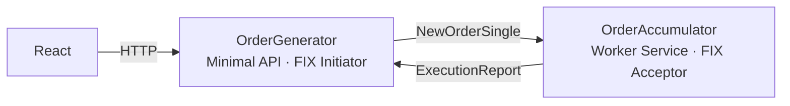
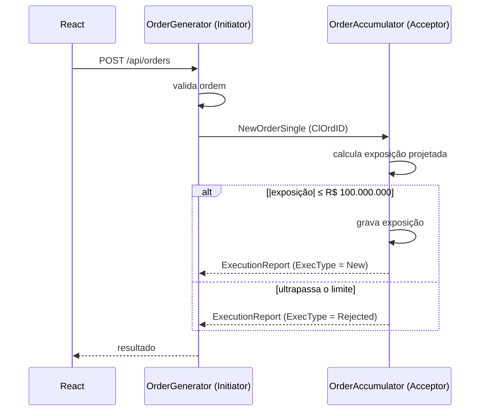

# OrderSystem

Duas aplicações independentes que se comunicam via FIX 4.4 (QuickFIX/n):

- **OrderGenerator**: API em C# com frontend React. Envia ordens (`NewOrderSingle`).
- **OrderAccumulator**: serviço em C#. Calcula a exposição financeira por símbolo e aceita ou rejeita cada ordem (`ExecutionReport`).

## Arquitetura





### Decisões

- .NET 10 e QuickFIXn 1.14.1 (`QuickFIXn.Core`, `QuickFIXn.FIX44`).
- Regra de exposição em `OrderAccumulator.Core`, sem dependência do QuickFIX.
- Cálculo, verificação do limite e gravação executados de forma atômica (`lock`).
- Valores monetários em `decimal`.
- Estado em memória.
- Rejeição com `OrdRejReason = 3` (Order exceeds limit).

### Premissas

- Quantidade executada = quantidade da ordem aceita.
- Exposição igual a R$ 100.000.000 é aceita; somente valores acima são rejeitados.
- O limite se aplica em valor absoluto (compra e venda).

## Estrutura

```
backend/
├── OrderSystem.slnx
└── OrderAccumulator/
    ├── src/
    │   ├── OrderAccumulator.Core/
    │   │   ├── Orders/        Order, OrderSide
    │   │   └── Exposure/      ExposureCalculator, ExposureDecision
    │   └── OrderAccumulator.Worker/
    │       └── Fix/           FixOrderTranslator
    └── tests/
        └── OrderAccumulator.Tests/
            ├── Exposure/      ExposureCalculatorTests
            └── Fix/           FixOrderTranslatorTests
```

## Testes

xUnit, sem dependência de rede.

### ExposureCalculatorTests

| Teste | Regra |
|---|---|
| `Simbolo_sem_ordens_tem_exposicao_zero` | Exposição inicial é zero |
| `Compra_aceita_aumenta_a_exposicao` | Compra soma preço × quantidade |
| `Venda_aceita_diminui_a_exposicao` | Venda subtrai preço × quantidade |
| `Compra_e_venda_se_compensam` | Compras e vendas se compensam |
| `Exposicao_e_calculada_por_simbolo` | Exposição independente por símbolo |
| `Ordem_que_atinge_exatamente_o_limite_e_aceita` | Limite exato é aceito |
| `Compra_que_ultrapassa_o_limite_e_rejeitada` | Acima de +100M é rejeitada |
| `Venda_que_ultrapassa_o_limite_negativo_e_rejeitada` | Abaixo de −100M é rejeitada |
| `Ordem_rejeitada_nao_altera_a_exposicao` | Rejeitada não entra no cálculo |
| `Ordem_que_reduz_a_exposicao_e_aceita_mesmo_no_limite` | Ordem que reduz a exposição é aceita |
| `Ordens_concorrentes_nunca_ultrapassam_o_limite` | 1.000 ordens paralelas de R$ 50M: exatamente 2 aceitas |

### FixOrderTranslatorTests

| Teste | Regra |
|---|---|
| `ToOrder_converte_os_campos_da_mensagem` | `NewOrderSingle` → `Order` (compra e venda) |
| `Ordem_aceita_gera_ExecutionReport_New` | `ExecType`/`OrdStatus = New`, mesmo `ClOrdID`, campos obrigatórios da 4.4 |
| `Ordem_rejeitada_gera_ExecutionReport_Rejected` | `ExecType`/`OrdStatus = Rejected`, `OrdRejReason = 3`, `Text`, `LeavesQty = 0` |

## Execução

Pré-requisito: .NET 10 SDK.

```powershell
cd backend
dotnet test
```